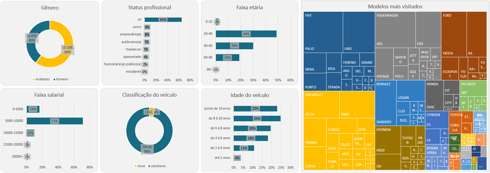

# Customer Profile & Vehicle Interest Analysis

Customer demographic and vehicle interest analysis using SQL with dashboard visualization.

This project analyzes customer profile data and vehicle browsing behavior to understand lead characteristics and automotive demand patterns using SQL queries and a dashboard.

---

# Project Overview

The objective of this project is to analyze customer demographics and vehicle interest behavior, extracting insights about:

- Gender distribution of leads  
- Professional status of customers  
- Age group segmentation  
- Income range distribution  
- Vehicle classification (new vs used)  
- Vehicle age preference  
- Most visited vehicles by brand and model  

The analysis was performed using **PostgreSQL** and the results were visualized in an **Excel dashboard**.

---

# Technologies Used

- SQL (PostgreSQL)
- Excel Dashboard
- Data Analysis
- Customer Segmentation
- Automotive Analytics

---

# Dashboard Preview



---

# Key Business Metrics

The project analyzes the following key metrics:

- Leads by Gender  
- Leads by Professional Status  
- Leads by Age Group  
- Leads by Income Range  
- Vehicle Classification (New vs Used)  
- Vehicle Age Distribution  
- Most Visited Brands  
- Most Visited Models  
- Vehicle Demand Patterns  

---

# SQL Analysis

The SQL queries used for the analysis are organized in the `SQL` folder:

| File | Description |
|------|-------------|
| 01_leads_gender.sql | Gender distribution of leads |
| 02_leads_professional_status.sql | Professional status segmentation |
| 03_leads_age_group.sql | Age group analysis |
| 04_leads_income_range.sql | Income range distribution |
| 05_vehicle_classification.sql | New vs used vehicle classification |
| 06_vehicle_age_distribution.sql | Vehicle age distribution |
| 07_most_visited_vehicles.sql | Most visited vehicles by brand and model |

---

# Project Structure

```
customer-profile-vehicle-interest-analysis
│
├── 📁 Dashboard
│   ├── customer-profile-dashboard.xlsx
│   └── dashboard_preview.png
│
└── 📁 SQL
    ├── 01_leads_gender.sql
    ├── 02_leads_professional_status.sql
    ├── 03_leads_age_group.sql
    ├── 04_leads_income_range.sql
    ├── 05_vehicle_classification.sql
    ├── 06_vehicle_age_distribution.sql
    └── 07_most_visited_vehicles.sql
```

---

# Business Insights

This analysis helps understand:

- Customer demographic profile  
- Purchasing power distribution  
- Most common professional segments  
- Preference for new vs used vehicles  
- Vehicle age demand  
- Most visited brands and models  
- Customer interest behavior  

These insights can support marketing strategy, segmentation, and automotive sales planning.

---

# Author

Caio Faria Suzuki Costa
